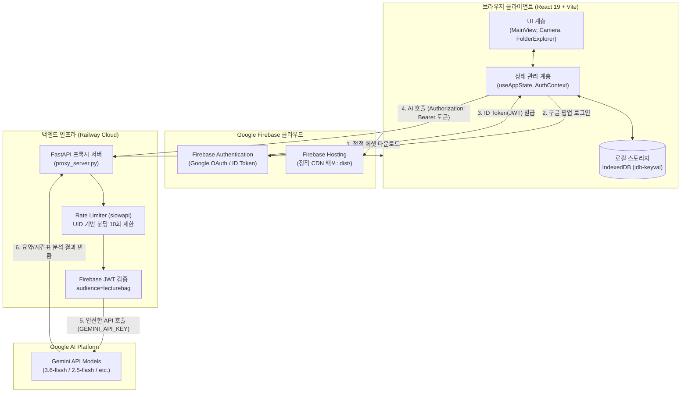

# 📚 LectureBag 통합 아키텍처 & 운영 매뉴얼

본 문서는 **LectureBag** 서비스의 시스템 설계, 데이터 처리 파이프라인, 보안 구조, 배포 프로세스 및 실전 트러블슈팅 절차를 상세히 기술한 운영 가이드입니다.

---

## 1. 시스템 전체 아키텍처 개요

LectureBag은 **클라이언트 중심(Client-First)의 반응형 웹 애플리케이션(PWA/SPA)** 과 **AI 보안 프록시 백엔드**가 결합된 하이브리드 클라우드 아키텍처로 설계되었습니다.



### 각 계층의 핵심 역할
1. **프론트엔드 (React 19 + TypeScript + Vite)**:
   * 웹캠/카메라 뷰파인더 제어, 캔버스 기반 WebP 실시간 압축, 오디오 녹음 처리.
   * 복잡한 폴더 트리(년/월/일/교시) 자동 계산 및 주간/학기 시간표 렌더링.
2. **Firebase Auth & Hosting**:
   * Google 계정 기반 간편 로그인 및 단기 JWT ID 토큰 발급.
   * 전 세계 글로벌 CDN을 통한 고속 웹 애플리케이션 배포.
3. **Railway 백엔드 프록시 (`proxy_server.py`)**:
   * 과금 위험이 있는 `GEMINI_API_KEY`를 브라우저에 절대 노출하지 않고 안전하게 은닉.
   * 유효한 구글 로그인 사용자만 API를 쓸 수 있도록 인가(Authorization) 필터링 수행.
4. **Google Gemini API**:
   * 업로드된 시간표 이미지 자동 인식(OCR + JSON 구조화) 및 강의 노트/음성 자동 요약.

---

## 2. 디렉터리 구조 및 핵심 모듈 역할 명세

```
LectureBag/
├── src/
│   ├── components/                # 재사용 가능한 UI 컴포넌트
│   │   ├── FolderExplorerModal.tsx # 날짜별 폴더 탐색기, 시간표 관리, 회원정보/설정 통합 모달 (~4,400줄)
│   │   ├── MarkdownViewer.tsx      # Gemini가 생성한 AI 요약 마크다운 렌더러 (코드 하이라이팅, 복사)
│   │   └── MediaPreviewModal.tsx   # 사진 확대보기 및 음성 녹음 재생 플레이어
│   ├── context/                   # 전역 React Context
│   │   ├── AuthContext.tsx        # Firebase Auth 구독, 구글 로그인/로그아웃, getIdToken 발급
│   │   └── AccentColorContext.tsx # 앱 전체 테마 강조 색상(Accent Color) 동적 관리
│   ├── hooks/                     # 커스텀 React 훅
│   │   ├── useAuth.ts             # AuthContext 구독 편의 훅
│   │   └── useDeviceType.ts       # 모바일/태블릿/데스크톱 뷰포트 반응형 감지
│   ├── models/                    # 비즈니스 데이터 및 스토리지 계층
│   │   └── useAppState.ts         # 사진, 음성 녹음, 시간표 전역 상태 및 IndexedDB 비동기 동기화
│   ├── utils/                     # 순수 유틸리티 함수
│   │   ├── firebase.ts            # Firebase Client SDK 초기화 및 로컬 세션 영속성 설정
│   │   ├── gemini.ts              # 백엔드 프록시 통신 모듈 (Bearer 토큰 자동 주입)
│   │   ├── dateFolders.ts         # 촬영 시간 및 시간표 매칭 기반 자동 폴더 분류 알고리즘
│   │   └── imageCompression.ts    # 캔버스 기반 WebP 압축 (브라우저 스토리지 절약)
│   ├── views/                     # 최상위 뷰 레이아웃
│   │   ├── MainView.tsx           # 메인 레이아웃 및 뷰 전환 오케스트레이션
│   │   └── CameraViewport.tsx     # 고성능 카메라 뷰파인더, 촬영 애니메이션, 플래시/그리드
│   ├── App.tsx                    # AuthProvider 및 AccentColorProvider 최상위 공급
│   └── types.ts                   # 미디어, 사진, 녹음, 시간표 공통 TypeScript 인터페이스
├── proxy_server.py                # FastAPI 백엔드 (JWT 토큰 검증, UID 기반 Rate Limiting)
├── requirements.txt               # 파이썬 의존성 패키지 목록 (FastAPI, google-auth, slowapi 등)
├── Procfile                       # Railway 컨테이너 실행 명령어 (`web: uvicorn proxy_server:app ...`)
├── firebase.json                  # Firebase Hosting SPA 라우팅(리라이트) 및 캐시 헤더 규칙
├── .firebaserc                    # Firebase 기본 프로젝트 지정 (`lecturebag`)
└── .env                           # 로컬 환경변수 (비밀키 포함, Git 절대 제외)
```

---

## 3. 데이터 흐름 및 로컬 스토리지 (IndexedDB)

### 3.1 Local-First 원칙
* 사용자가 촬영한 사진과 녹음 데이터는 중앙 서버 데이터베이스가 아닌 **사용자 기기의 브라우저 내부 스토리지(IndexedDB)** 에 직접 저장됩니다.
* **장점**:
  1. 서버 스토리지 및 네트워크 트래픽 비용이 **0원**입니다.
  2. 네트워크 속도와 무관하게 즉각적인 로딩 속도를 보장합니다.
  3. 민감한 강의 사진 및 녹음이 외부에 유출되지 않는 강력한 프라이버시를 가집니다.
* **영속성 보장 (`navigator.storage.persist()`)**:
  브라우저가 디스크 용량 부족을 이유로 IndexedDB 캐시를 임의로 비우지 못하도록 마운트 시 영구 스토리지 권한을 요청합니다.

### 3.2 사용자(UID) 단위 데이터 격리 원리
서로 다른 계정이 같은 기기를 사용할 때 데이터가 섞이는 문제를 원천 차단하기 위해 계정별 네임스페이스를 분리했습니다:
* **로그인 사용자**:
  * 사진: `lecture_snap_photos_{user.uid}`
  * 녹음: `lecture_snap_recordings_{user.uid}`
  * 시간표: `lecture_snap_semester_timetables_{user.uid}`
* **게스트(미로그인)**:
  * 기존 레거시 키(`lecture_snap_photos` 등)를 사용하여 기존 로컬 데이터를 유지합니다.
* **계정 전환 시 동작**:
  `useAppState.ts`의 `useEffect([user])` 훅이 사용자 변경을 감지하여, 메모리 상태를 초기화하고 새 사용자의 IndexedDB 데이터만 즉시 불러옵니다.

---

## 4. 다층 보안 아키텍처 (Multi-Layer Security)

| 계층 | 적용 위치 | 동작 방식 및 보호 목적 |
| :--- | :--- | :--- |
| **1. API Key 은닉** | 백엔드 (`proxy_server.py`) | 과금 위험이 있는 `GEMINI_API_KEY`는 Railway 서버 메모리에만 상주하며, 브라우저에는 1바이트도 노출되지 않습니다. |
| **2. 토큰 인가 게이트** | 백엔드 미들웨어 | 모든 AI 요청 시 구글 서명 JWT 토큰 검증. 미인증 요청은 즉각 `401 Unauthorized`로 차단합니다. |
| **3. 위조 프로젝트 차단** | `audience="lecturebag"` | 타 Firebase 프로젝트에서 발급된 유효한 토큰이라도, 우리 프로젝트(`lecturebag`) 대상이 아니면 거부합니다. |
| **4. UID 기반 Rate Limit** | `slowapi` (`get_uid_or_ip`) | IP 대신 **구글 계정(UID)별로 분당 10회** 쿼터를 적용합니다. 같은 학교/기숙사 와이파이(공용 IP) 환경에서도 다수의 사용자가 독립적으로 정상 이용 가능합니다. |
| **5. CORS 도메인 격리** | FastAPI CORSMiddleware | `https://lecturebag.web.app`, `https://lecturebag.firebaseapp.com`, 로컬 개발 포트(`5173`, `4173`) 이외의 도메인에서 들어오는 브라우저 호출을 차단합니다. |

---

## 5. 배포 및 인프라 운영 규칙

### 5.1 배포 2대 경로 요약

```
[프론트엔드 UI 수정 시]
src/ 내 코드 수정 ➡️ npm run build ➡️ firebase deploy --only hosting ➡️ Firebase CDN 즉시 반영

[백엔드 API 수정 시]
proxy_server.py / requirements.txt 수정 ➡️ git commit & git push origin main ➡️ Railway 자동 빌드/배포
```

### 5.2 SPA 라우팅 및 캐시 정책 (`firebase.json`)
* **HTML 리라이트**: 사용자가 새로고침하거나 브라우저 주소창에 직접 접속해도 404 에러가 나지 않도록 모든 경로를 `/index.html`로 연결(`rewrites`)합니다.
* **정적 에셋 캐싱**: `dist/assets/**`의 자바스크립트/CSS 파일은 해시 파일명을 사용하므로 `max-age=31536000, immutable`(1년 캐시)로 최고 속도를 내며, `index.html`은 `no-cache`로 항상 최신 버전을 제공합니다.

---

## 6. 환경변수(Env) 관리 규약

### 6.1 환경변수 구분표

| 환경변수명 | 위치 | 용도 및 취급 주의사항 |
| :--- | :--- | :--- |
| `GEMINI_API_KEY` | **Railway 대시보드 / 로컬 `.env`** | 🚨 **절대 비밀키**: AI 호출 권한. GitHub 커밋 절대 금지 |
| `VITE_FIREBASE_API_KEY` | **로컬 `.env`** | Firebase 클라이언트 식별자 (브라우저 공개용) |
| `VITE_FIREBASE_AUTH_DOMAIN` | **로컬 `.env`** | `lecturebag.firebaseapp.com` |
| `VITE_FIREBASE_PROJECT_ID` | **로컬 `.env` / Railway** | `lecturebag` (토큰 audience 일치 검증용) |
| `VITE_FIREBASE_STORAGE_BUCKET` | **로컬 `.env`** | `lecturebag.firebasestorage.app` |
| `VITE_FIREBASE_MESSAGING_SENDER_ID` | **로컬 `.env`** | 구글 클라우드 발신자 ID |
| `VITE_FIREBASE_APP_ID` | **로컬 `.env`** | 웹 앱 고유 식별 번호 |

### 6.2 핵심 규칙
* Vite는 보안을 위해 **`VITE_` 접두사가 붙은 변수만 브라우저 코드에 포함**시킵니다.
* 백엔드 전용 비밀키(`GEMINI_API_KEY`)에는 의도적으로 `VITE_`를 붙이지 않아 브라우저 번들에 포함되는 실수를 차단합니다.

---

## 7. 로컬 개발 및 무결성 검증 루틴

### 7.1 로컬 구동 명령어
```bash
# 터미널 1: 백엔드 프록시 구동 (포트 8000)
python3 proxy_server.py

# 터미널 2: 프론트엔드 개발 서버 구동 (포트 3000 / 5173)
npm run dev
```

### 7.2 배포 전 무결성 검증 명령어
코드 수정 후 배포하기 전에 아래 명령어를 실행하여 타입 에러와 번들링 문제를 사전에 방지합니다:
```bash
npm run lint    # TypeScript 정적 타입 검사 (tsc --noEmit)
npm run build   # Vite 프로덕션 빌드 번들링 검증
```

---

## 8. 실전 장애 진단 및 트러블슈팅 가이드 (Runbook)

| 증상 | 발생 원인 | 해결 절차 |
| :--- | :--- | :--- |
| **로그인 팝업 클릭 시 `auth/unauthorized-domain` 에러** | 현재 접속 주소가 Firebase 허용 도메인에 미등록됨 | [Firebase Console] ➡️ Authentication ➡️ Settings ➡️ Authorized domains에 도메인 추가 |
| **AI 요약/시간표 분석 시 `401 Unauthorized`** | 구글 로그인 토큰 누락 또는 프로젝트 불일치 | 1. 브라우저에서 로그아웃 후 재로그인 시도<br>2. Railway 환경변수의 `VITE_FIREBASE_PROJECT_ID`가 `lecturebag`인지 확인 |
| **AI 요청 시 `429 Too Many Requests`** | 분당 호출 횟수(10회) 초과 | 매크로 방어 기능이 정상 작동한 것입니다. 1분 후 쿼터가 자동 리셋되므로 잠시 후 재시도 |
| **AI 요청 시 `500 Internal Server Error`** | 백엔드의 Gemini API 키가 유효하지 않음 | Railway 대시보드 ➡️ Variables ➡️ `GEMINI_API_KEY` 값 정상 여부 및 할당량 확인 |
| **새로고침 시 `404 Not Found` (배포 사이트)** | Firebase Hosting SPA 리라이트 누락 | `firebase.json` 파일의 `rewrites` 항목이 정상적으로 설정되어 있는지 확인 후 재배포 |
| **저장해 둔 사진/녹음이 사라짐** | 브라우저 쿠키/사이트 데이터 삭제 또는 시크릿 모드 | IndexedDB는 기기 로컬에 저장되므로 브라우저 청소 시 비워질 수 있습니다. (정상 동작) |

---

## 9. 향후 확장 권장 과제 (Roadmap)

1. **클라우드 데이터 동기화 (Cloud Backup)**:
   * 로컬 IndexedDB에 저장되는 미디어와 시간표를 Firebase Firestore 및 Storage로 백업하는 파이프라인 구축. (기기 간 실시간 동기화 지원)
2. **AI 요약 결과 외부 내보내기**:
   * 생성된 마크다운을 PDF 또는 Notion 페이지로 바로 내보내는 원클릭 Export 기능.
3. **PWA 오프라인 모드 완성**:
   * 서비스 워커(`vite-plugin-pwa`)를 추가하여 네트워크가 끊긴 오프라인 환경에서도 촬영 및 재생을 100% 보장.
